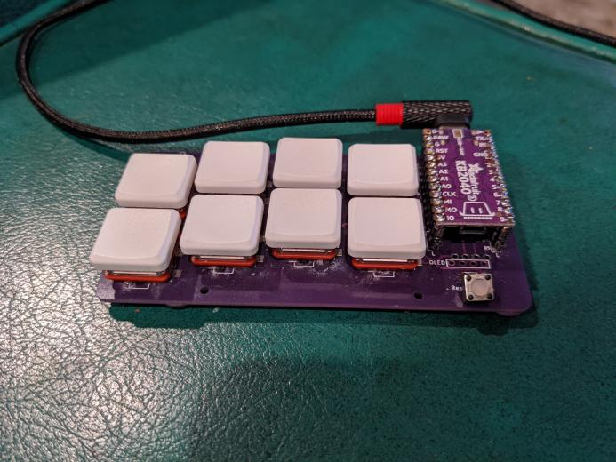

# kmk-ardux
KMK implementation of ardux. A fork of artsey.io
https://github.com/KMKfw/kmk_firmware

  
  

## Current Issues
* OneShot keys seem to stick rather than disabling after timeout or a keypress. 
* Mouse Functionality
* Implement shift hold (not caps lock - caps doesn't apply to numbers)
* Documenting stable circuitpython release and kmk release for any work here. 
* What else?

## Usage Notes
I belive kmk can be built into a firmware image. This might be worth looking into.  
  
**Installation** with CircuitPython:
* Load Circuitpython onto the rp2040 device
* Copy the kmk directory from the kmk repo to the device
* Create a code.py for your keyboard - e.g. copy paintbrush_left.py to code.py on your rp2040 device.  
  
**Updates and debugging**
Normally the keyboard will start working within a few seconds of copying the kmk dir and code.py to it, but if not, check the serial console for crash dumps.  You can use an IDE like Thonny to edit the code.py on the device and view the serial terminal. 

## CircuitPython dev in Linux Notes
Use screen to open a serial console on the rp2040 device:  
```
sudo apt install screen
screen /dev/ttyACM0 # or ACM1, etc, depending on what shows up.
```  
  


